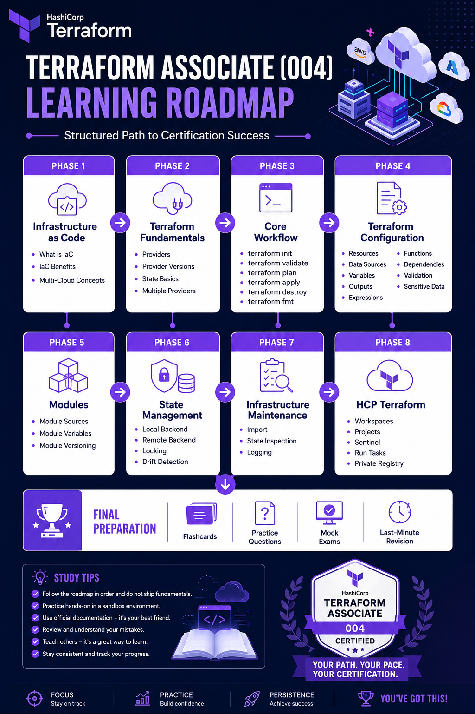
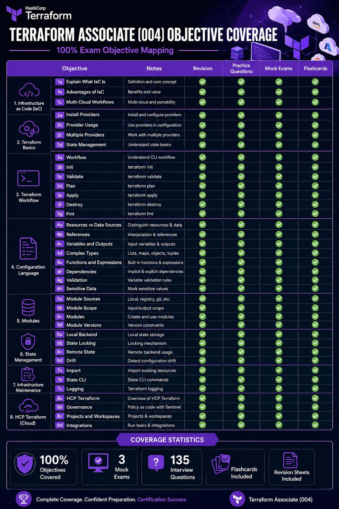
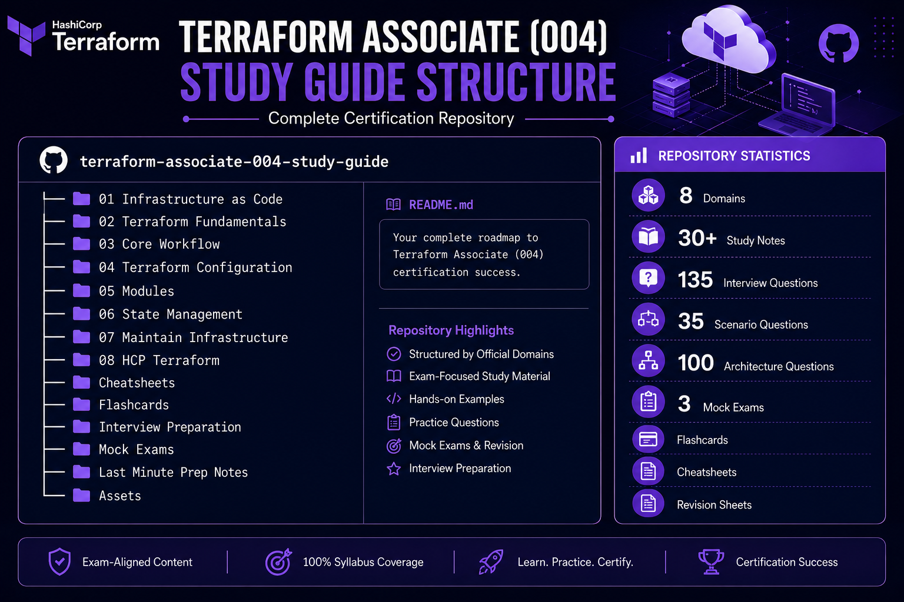
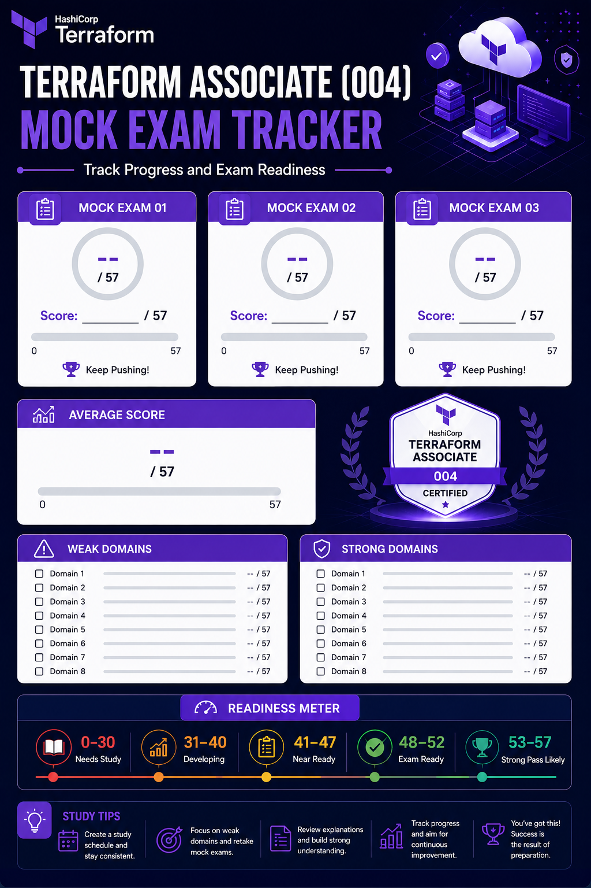
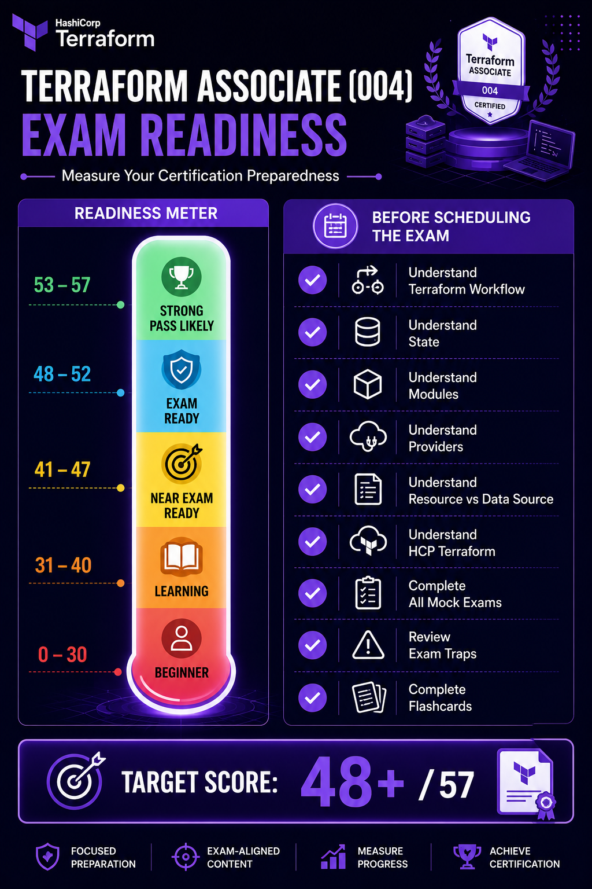

# Terraform Associate (004) Exam Prep

> Comprehensive Terraform Associate (004) certification preparation repository featuring exam-focused study notes, revision sheets, flashcards, practice questions, mock exams, cheatsheets, HCP Terraform concepts, interview preparation, and real-world Terraform examples.

-banner.png)

<p align="center">


</p>

---

# Certification Overview

| Item              | Details                                     |
| ----------------- | ------------------------------------------- |
| Certification     | Terraform Associate (004)                   |
| Vendor            | HashiCorp                                   |
| Focus             | Infrastructure as Code (IaC) with Terraform |
| Coverage          | 100% Official Exam Objectives               |
| Learning Approach | Theory + Hands-On + Revision + Mock Exams   |
| Repository Type   | Complete Certification Study Guide          |

---

# Repository Statistics

| Category                 | Count |
| ------------------------ | ----: |
| Domains Covered          |     8 |
| Objective Notes          |   30+ |
| Revision Sheets          |     8 |
| Practice Questions       |  200+ |
| Flashcards               |  300+ |
| Interview Questions      |   135 |
| Scenario-Based Questions |    35 |
| Architecture Questions   |   100 |
| Mock Exams               |     3 |
| Mock Exam Questions      |   171 |
| Objective Coverage       |  100% |

---

# Exam Objectives

| Domain | Topics                                      |
| ------ | ------------------------------------------- |
| 1      | Infrastructure as Code (IaC) with Terraform |
| 2      | Terraform Fundamentals                      |
| 3      | Core Terraform Workflow                     |
| 4      | Terraform Configuration                     |
| 5      | Terraform Modules                           |
| 6      | Terraform State Management                  |
| 7      | Maintain Infrastructure with Terraform      |
| 8      | HCP Terraform                               |

---

# Objective Summary

## 1. Infrastructure as Code (IaC) with Terraform

Learn Infrastructure as Code principles, benefits of IaC patterns, and how Terraform supports multi-cloud and hybrid-cloud deployments.

## 2. Terraform Fundamentals

Understand providers, resources, provider versioning, state management, and Terraform architecture.

## 3. Core Terraform Workflow

Master Terraform's standard workflow including init, validate, fmt, plan, apply, and destroy.

## 4. Terraform Configuration

Work with variables, outputs, data sources, expressions, functions, validations, dependencies, complex types, and sensitive data.

## 5. Terraform Modules

Create reusable infrastructure using modules, manage versions, and understand variable scope.

## 6. Terraform State Management

Learn local and remote state, state locking, backends, drift detection, and state operations.

## 7. Maintain Infrastructure with Terraform

Import resources, inspect state, troubleshoot infrastructure, and use logging effectively.

## 8. HCP Terraform

Understand workspaces, projects, governance, collaboration, integrations, remote execution, and policy enforcement.

---

# Visual Study Resources

## Terraform Associate Learning Roadmap



---

## Exam Objective Coverage Matrix



---

## Repository Structure Overview



---

## Mock Exam Progress Tracker



---

## Certification Readiness Meter



---

# 14-Day Study Plan

| Day | Topics                                                   |
| --- | -------------------------------------------------------- |
| 1   | 1a, 1b, 1c - Infrastructure as Code (IaC)                |
| 2   | 2a, 2b - Providers and Provider Management               |
| 3   | 2c, 2d - Multiple Providers and Terraform State          |
| 4   | 3a, 3b, 3c - Core Workflow, Init, Validate               |
| 5   | 3d, 3e, 3f, 3g - Plan, Apply, Destroy, Fmt               |
| 6   | 4a, 4b, 4c - Resources, Data Sources, Variables, Outputs |
| 7   | 4d, 4e - Complex Types, Expressions, Functions           |
| 8   | 4f, 4g, 4h - Dependencies, Validation, Sensitive Data    |
| 9   | 5a, 5b, 5c, 5d - Terraform Modules                       |
| 10  | 6a, 6b, 6c, 6d - State Management                        |
| 11  | 7a, 7b, 7c - Infrastructure Maintenance                  |
| 12  | 8a, 8b, 8c, 8d - HCP Terraform                           |
| 13  | Practice Questions + Mock Exam 01                        |
| 14  | Mock Exam 02 + Mock Exam 03 + Final Revision             |

---

# Repository Structure

```text
terraform-associate-004-study-guide/

├── 01-Infrastructure-as-Code
├── 02-Terraform-Fundamentals
├── 03-Core-Terraform-Workflow
├── 04-Terraform-Configuration
├── 05-Terraform-Modules
├── 06-Terraform-State-Management
├── 07-Maintain-Infrastructure-with-Terraform
├── 08-HCP-Terraform

├── Cheatsheet
├── Flashcards
├── Interview-Preparation
├── Mock-Exams
├── Last-Minute-Prep-Notes
└── Assets
```

---

# Included Resources

## Study Notes

* Objective-by-objective Terraform notes
* Official exam objective coverage
* Production-oriented examples

## Revision Resources

* Domain Revision Sheets
* Last-Minute Prep Notes
* Exam-Day Cheatsheet
* Exam Tips and Traps

## Flashcards

* Terraform Associate Flashcards
* Terraform Commands Flashcards
* HCP Terraform Flashcards

## Interview Preparation

* 135 Terraform Interview Questions
* 35 Scenario-Based Questions
* 100 Architecture Questions
* Detailed Solution Guides

## Mock Exams

* Mock Exam 01
* Mock Exam 02
* Mock Exam 03

Total Questions:

```text
171 Certification-Style Questions
```

---

# Progress Tracker

* [ ] Domain 1: Infrastructure as Code
* [ ] Domain 2: Terraform Fundamentals
* [ ] Domain 3: Core Workflow
* [ ] Domain 4: Configuration
* [ ] Domain 5: Modules
* [ ] Domain 6: State Management
* [ ] Domain 7: Infrastructure Maintenance
* [ ] Domain 8: HCP Terraform
* [ ] Flashcards Completed
* [ ] Mock Exam 01 Completed
* [ ] Mock Exam 02 Completed
* [ ] Mock Exam 03 Completed
* [ ] Final Revision Completed

---

# Exam Readiness Guide

| Score | Assessment         |
| ----- | ------------------ |
| 0–30  | Needs More Study   |
| 31–40 | Developing         |
| 41–47 | Near Exam Ready    |
| 48–52 | Exam Ready         |
| 53–57 | Strong Pass Likely |

Recommended target before scheduling the exam:

```text
53+/57 on all mock exams
```

---

# Goal

Pass the Terraform Associate (004) certification while building production-relevant Terraform knowledge and maintaining a reusable Terraform reference repository.

---

# Contributions & Feedback

Found an error, outdated information, typo, incorrect explanation, or a Terraform Associate (004) exam objective that could be improved?

Contributions are welcome.

If you identify any issue in the repository:

* Open an Issue describing the problem
* Submit a Pull Request with the proposed correction
* Include a clear explanation of the change
* Reference the affected file(s) whenever possible

Examples of valuable contributions:

* Terraform documentation updates
* Exam objective improvements
* Correction of technical inaccuracies
* Better Terraform examples
* Additional practice questions
* Mock exam enhancements
* Grammar and formatting fixes

Please ensure all contributions:

* Follow official HashiCorp terminology
* Remain aligned with Terraform Associate (004) objectives
* Maintain repository structure and naming conventions
* Preserve consistency with existing content

Every contribution helps improve the study experience for future Terraform learners.

Thank you for helping make this repository more accurate and useful.


# Authors

### Sonu Kumar Kushwaha

GitHub: **sonukkushwaha0801**

### Zenithra [AKA **Sonu Kumar Kushwaha**]

GitHub: **zenithrahub**

## Contributors

Thanks to everyone who has contributed to this repository.

<a href="https://github.com/sonukkushwaha0801/Terraform-associate-004-exam-prep/graphs/contributors">
  
</a>


If this repository helped you prepare for the Terraform Associate (004) certification, consider giving it a ⭐ on GitHub.

